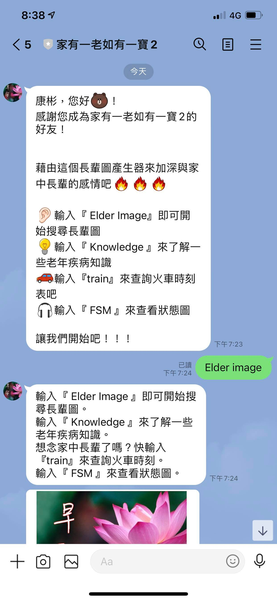
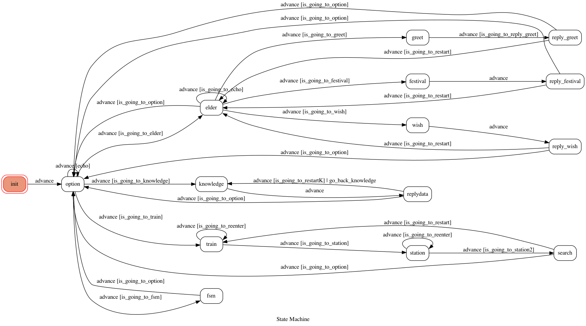
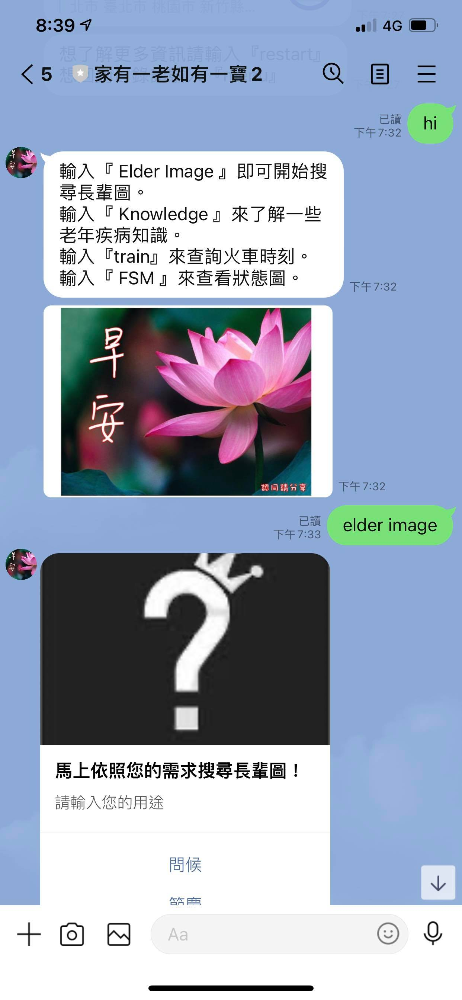
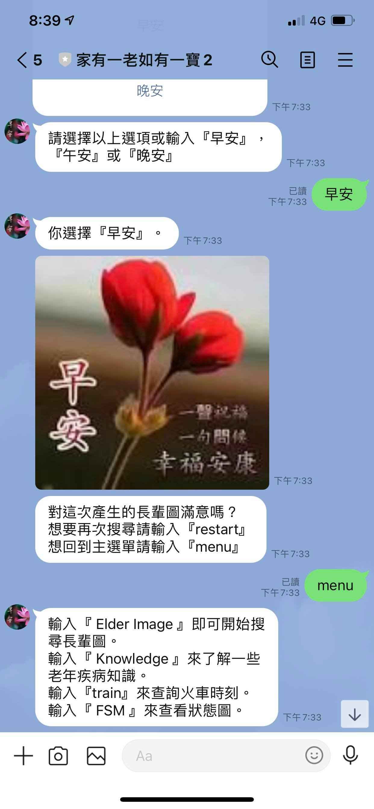
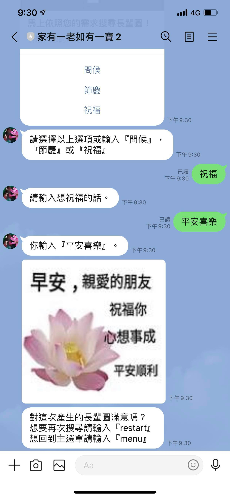
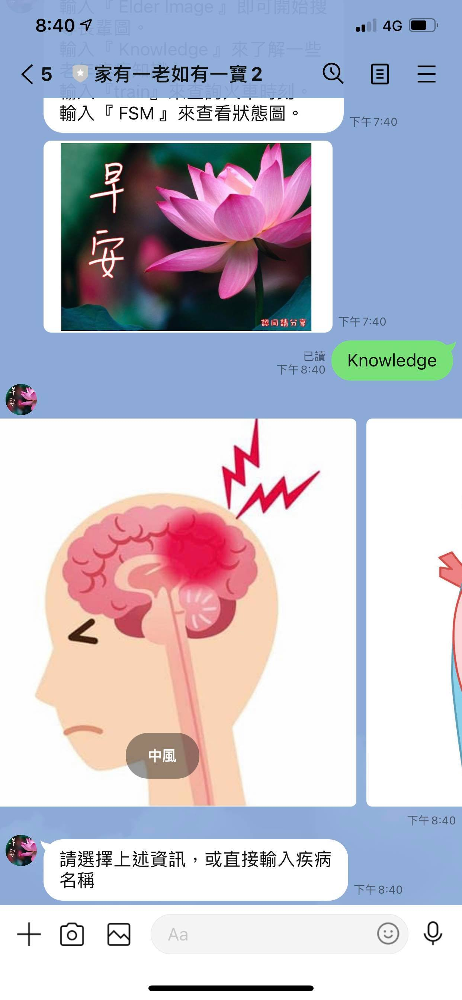
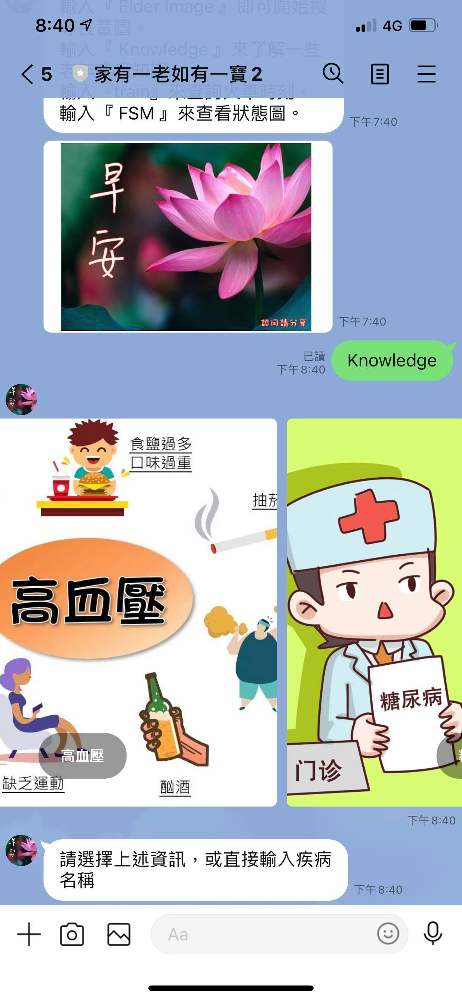
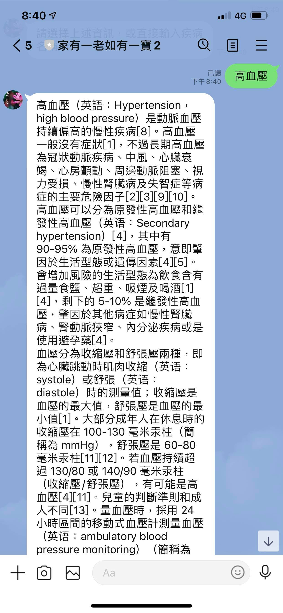
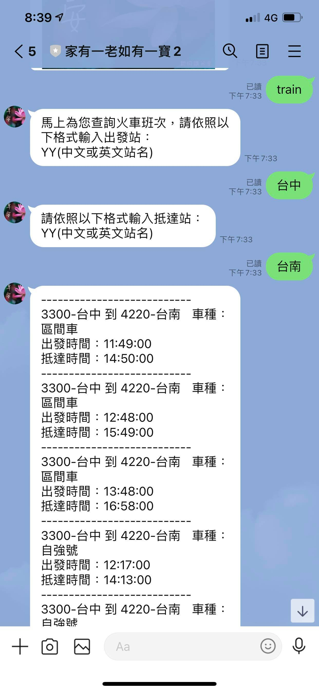
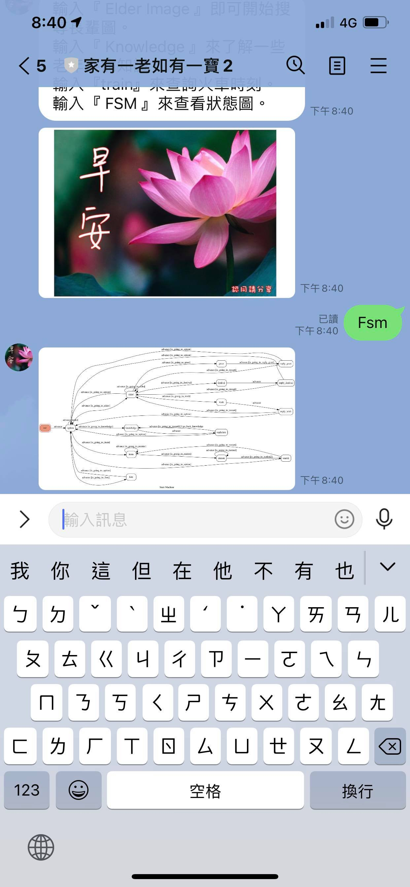

# Line-Bot-Elder

    

    
    

## 說明
> 使用FSM(有限狀態機)的概念 實作Line Bot

建立一個可以列出搜尋長輩圖，基本疾病資料，火車時刻表的Line Bot

## 功能
* 客製化搜尋長輩圖
* 查詢維基上疾病的資訊
* 查詢近兩個小時的火車班次
* 可查詢 fsm graph
* 使用Line button回傳訊息

## FSM

## Function
**menu**
可以選擇要使用什麼功能

**elder image**
可用Line Button回覆可以客製化搜尋長輩圖

**Knowledge**
抓取維基百科上的部分資料

**train**
搜尋近三小時內的火車班次

**fsm**
印出fsm

## Demo
